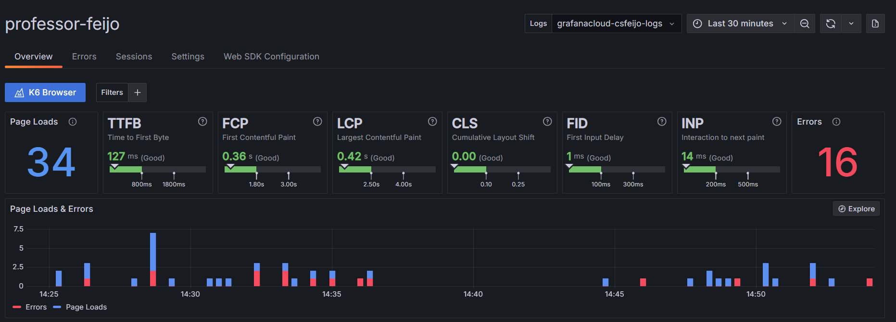

# Grafana Faro: levando a observabilidade para o frontend

## Projeto DEMO

Aplicação para demonstração e consulta sobre a palestra ministrada por mim no [TDC Florianópolis](https://thedevconf.com/tdc/2024/florianopolis/trilha-web-e-front-end) em 2024.

Baseado no material do vídeo [Mastering Frontend Observability in React with Grafana Faro](https://www.youtube.com/watch?v=IA_-zkpVhIU).

Para acesso a dashboard você precisa ter configurado o seu projeto na [Grafana Cloud](https://grafana.com/auth/sign-in/).



## Requisitos

- Node18 >=
- React
- Vite
- pnpm
- crie uma conta em [Grafana Cloud](https://grafana.com/auth/sign-in/)

## Execução

Cumprindo os requisitos acima execute:

```
pnpm install
pnpm run dev
```

O servidor será iniciado em `http://localhost:5173`

## Dúvidas

Me contate se houver necessidade e use o conteúdo desse repositório como desejar.

[Professor Feijó](https://professorfeijo.com.br)
