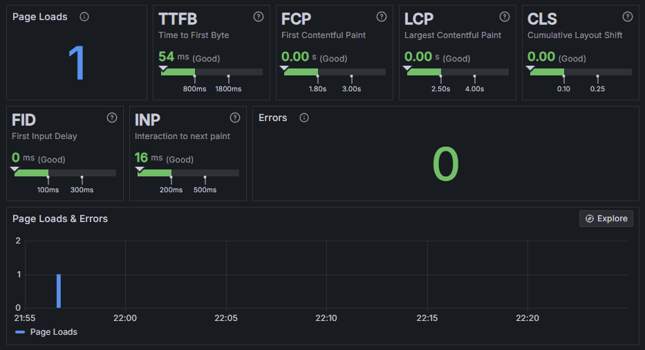

# Grafana Faro: levando a observabilidade para o frontend

## Projeto DEMO

Material para demonstração e consulta sobre a palestra que ministrei nos eventos:
- [Observabilidade no Frontend com Grafana Faro](https://tecnopuc.pucrs.br/evento/esquenta-tdc-sao-paulo-observabilidade-no-frontend-com-grafana-faro/) em ago/2024 - Esquenta TDC São Paulo / OSGUFERS
- [Grafana Faro - Levando a Observabilidade para o Frontend](https://thedevconf.com/tdc/2024/florianopolis/trilha-web-e-front-end) em jun/2024 - TDC Florianópolis

Baseado no material do vídeo [Mastering Frontend Observability in React with Grafana Faro](https://www.youtube.com/watch?v=IA_-zkpVhIU).

Para acesso a dashboard você precisa ter configurado o seu projeto na [Grafana Cloud](https://grafana.com/auth/sign-in/).



## Requisitos

- Node18 >=
- React
- Vite
- pnpm
- uma conta em [Grafana Cloud](https://grafana.com/auth/sign-in/)

## Execução

Cumprindo os requisitos acima execute:

```
pnpm install
pnpm run dev
```

O servidor será iniciado em `http://localhost:5173`

Renomeie o arquivo `.env.template` conforme o template fornecido para `.env` preenchendo com os valores de APP_ID e APP_KEY fornecidos pela dashboard do Grafana.
```
# .env - copie para um arquivo .env (remova o .template do nome)
VITE_FARO_APP_ID=<APP_ID>
VITE_FARO_APP_KEY=<APP_KEY>
```

## Dúvidas

Me contate se houver necessidade e use o conteúdo desse repositório como desejar.

[Professor Feijó](https://professorfeijo.com.br)
